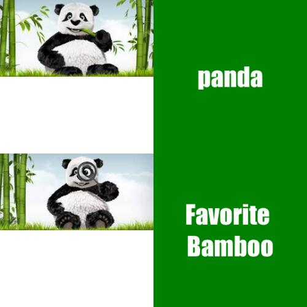

# Assignments 1

*welcome to my homepage*

## About my Assignments 1

**My theme is that pandas are also China's national treasures.**
**Below is a meme picture I made using the R package {magick}.**

library(magick)
panda_1 <- image_read("https://encrypted-tbn0.gstatic.com/images?q=tbn:ANd9GcRFU7U2h0umyF0P6E_yhTX45sGgPEQAbGaJ4g&usqp=CAU") %>%
  image_scale(300)
stats_text <- image_blank(width = 300, 
                          height = 300, 
                          color = "green") %>%
  image_annotate(text = "panda",
                 color = "#FFFFFF",
                 size = 50,
                 font = "Impact",
                 gravity = "center")
panda_2 <- image_read("https://encrypted-tbn0.gstatic.com/images?q=tbn:ANd9GcQE_Ys-x5FejCwJpsdqXPRgriNYXj7N3w_yFmAcMdB8eFLXoejSDqyd-lQOTzc66RFG22Q&usqp=CAU") %>%
  image_scale(300)
ml_text <- image_blank(width = 300, 
                       height = 300, 
                       color = "green") %>%
  image_annotate(text = "Favorite \nBamboo",
                 color = "#FFFFFF",
                 size = 50,
                 font = "Impact",
                 gravity = "center")

panda_vector <- c(panda_1, stats_text)
top_row <- image_append(panda_vector)
bottom_row <- image_append(c(panda_2, ml_text))

meme <- c(top_row, bottom_row) %>%
  image_append(stack = TRUE) %>%
  image_scale(500)
image_write(meme, "my_meme.png")
## About meme picture

One of the inspirations for my meme is very simple:

- I found a cute panda
- I also use other action pandas
